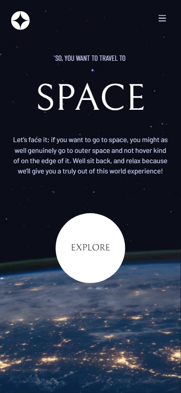

# Frontend Mentor - Space tourism website solution

This is my solution to the [Space tourism website challenge on Frontend Mentor](https://www.frontendmentor.io/challenges/space-tourism-multipage-website-gRWj1URZ3). Frontend Mentor challenges help you improve your coding skills by building realistic projects. This was a really great project and felt like my first real project where I created a actual website.

## Table of contents

- [Overview](#overview)
  - [The challenge](#the-challenge)
  - [Screenshot](#screenshot)
  - [Links](#links)
- [My process](#my-process)
  - [Built with](#built-with)
  - [What I learned](#what-i-learned)
  - [Continued development](#continued-development)
- [Author](#author)
- [Acknowledgments](#acknowledgments)

## Overview

### The challenge

Users should be able to:

- View the optimal layout for each of the website's pages depending on their device's screen size
- See hover states for all interactive elements on the page
- View each page and be able to toggle between the tabs to see new information

### Screenshot



### Links

- Solution URL: [GitHub](https://github.com/dawkey95/Space-Tourism)
- Live Site URL: [Space Tourism](https://dkcoding-space-tourism.vercel.app/)

## My process

### Built with

- Semantic HTML5 markup
- Flexbox
- Mobile-first workflow
- [React](https://reactjs.org/) - JS library
- [Next.js](https://nextjs.org/) - React framework
- [Tailwind](https://tailwindcss.com/) - For styles

### What I learned

The biggest thing I learnt doing this project was how to use NextJS 13 as I have never used nextjs. I learnt how to use the app/ directory. I found nextjs 13 really enjoyable to use and will be focusing my energy on becoming more proficient with nextjs. One my biggest 'oooh' moments was when I needed to figure out how to keep what tab the user is on in the navbar. After a day or so of googling and searching I found that Nextjs 13 utilises

```js
import { usePathname } from "next/navigation";
```

you create your path variable:

```js
const path = usePathname();
```

this essentially allows you to use the url pathname to conditionally render components:

```js
<Link href="/crew/douglas-hurley">
  <button className={path === "/crew/douglas-hurley" ? "btn-active" : "btn"} />
</Link>
```

### Continued development

I want to keep learning NextJS and improve my React skills. I also want to learn more about Tailwind and how to use it in a more efficient way with NextUI and Tailwind Variants. I also want to focus on improving my folder structure and file naming conventions as well as improving my website performance. Learning about metadata and SEO practices alongside learning how to properly use HTML semantics.

## Author

- Website - [DK Coding](https://dk-personal.netlify.app/)
- Frontend Mentor - [@dawkey95](https://www.frontendmentor.io/profile/dawkey95)
- Twitter - [@dawidkeyser95](https://twitter.com/dawidkeyser95)

## Acknowledgments

Shout out to my friend Justin who gave me some ideas when I got stuck with the data extraction in the project.
